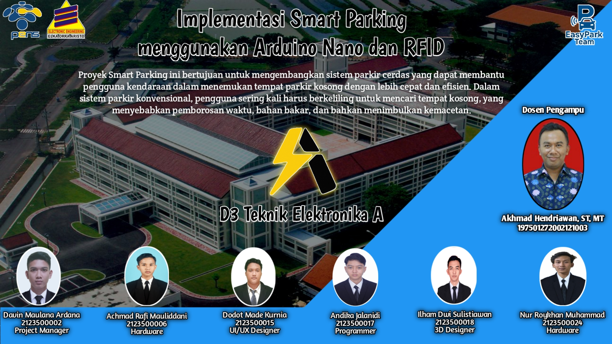

# 🛜 SMART PARKING

   

## Support By :
- Dosen Pengampu : Akhmad Hendriawan ST, MT
- Mata Kuliah : Workshop Mikrokontroller
- Program Studi : D3 Teknik Elektronika
- Institusi : Politeknik Elektronika Negeri Surabaya ( PENS )
  
## 👥 EasyPark Team Member

  

| Nama       | Nrp        | Jobdesk    |
|:----------:|:----------:|:----------:|
| Davin Maulana Ardana  | 2123500002 | Project Manager |
| Achmad Rafi Mauliddani  | 2123500006 | Hardware |
| Dodot Made Kurnia  | 2123500015 | UI/UX Designer |
| Andika Jalanidi  | 2123500017 | Programmer |
| Ilham Dwi Sulistiawan  | 2123500018 | 3D Designer |
| Nur Roykhan Muhammad | 2123500024 | Hardware |

## Deskripsi Projek
Sistem Smart Parking adalah solusi berbasis teknologi untuk mempermudah pencarian tempat parkir di area umum, seperti apartemen, pusat perbelanjaan, dan area publik lainnya. Sistem ini menggunakan sensor dan teknologi IoT untuk mendeteksi ketersediaan parkir secara real-time dan memberikan informasi langsung kepada pengguna. Tujuan utama proyek ini adalah untuk mengurangi waktu yang dihabiskan pengemudi dalam mencari tempat parkir dan mengoptimalkan penggunaan lahan parkir yang ada. Sistem ini tidak hanya memberikan kenyamanan bagi pengguna dengan cara yang efisien dan cepat, tetapi juga membantu pengelola parkir dalam memonitor kapasitas dan pendapatan parkir secara otomatis.

## Tujuan Proyek
- Menyediakan solusi parkir yang efisien dan modern untuk mengurangi waktu pencarian tempat parkir oleh pengguna.
- Mengurangi kemacetan di area parkir akibat kendaraan yang berkeliling mencari slot kosong.
- Memberikan informasi ketersediaan tempat parkir secara akurat kepada pengguna.
  
## Komponen 
| Nama Komponen       | Kegunaan        |
|:----------:|:----------:|
| Limit Swich | Untuk mengetahui di bagian mana slot parkir yang kosong |
| Infrared Sensor | Untuk mendeteksi apakah mobil sudah melewati pintu parkir |
| RFID  | Sebagai akses keluar dan masuk kendaraan | 
| Servo  | Untuk membuka dan menutup pintu masuk | 
| Arduino Nano  | Sebagai mikrokontroler yang akam di gunakan |
| Lcd Dislay 16x2 | Untuk menampilkan slot kosong di parkiran di pintu masuk |

## Blok Diagram Sistem

   

## Design PCB

   

## 3D Design Parking Slot

   

## Link Thingiverse 3D Design

**🔗[Teruskan ke website Thingverse](https://www.thingiverse.com/thing:7059087)**

## UI/UX Design

  

## Video Iklan
https://github.com/user-attachments/assets/c66144eb-d369-47d5-b7e9-3379c96ada36

